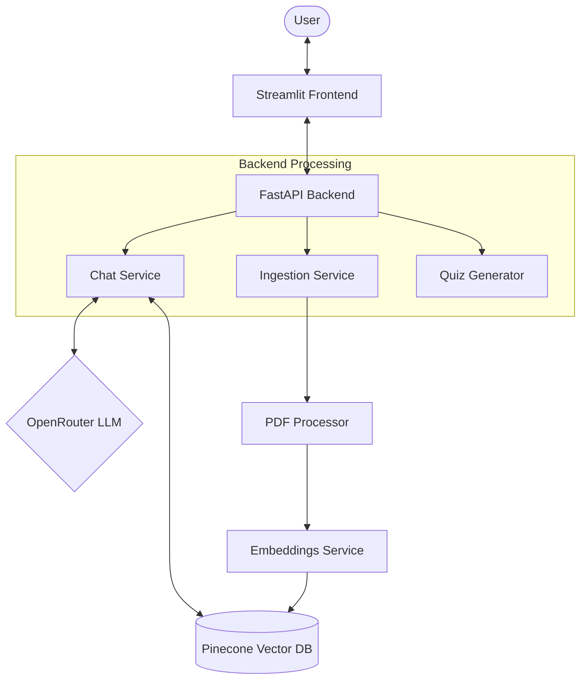

# 🎓 AI Tutor - Complete Project Guide

Welcome to the **AI Tutor** project! This document provides everything you need to know to run, understand, and maintain the platform.

---

## 🚀 Quick Start: Running the Project

The AI Tutor is split into two main services: a **FastAPI Backend** and a **Streamlit Frontend**.

### 1. Environment Activation
All dependencies are installed in the local virtual environment.
```powershell
.\venv\Scripts\activate
```

### 2. Start the Backend
The backend handles document ingestion, vector retrieval with Pinecone, and LLM orchestration via OpenRouter.
```powershell
# Navigate to backend directory
cd backend

# Start the uvicorn server
python -m uvicorn app.main:app --host 127.0.0.1 --port 8001 --reload
```
- **API Docs**: [http://127.0.0.1:8001/docs](http://127.0.0.1:8001/docs)
- **Health Check**: Port 8001 must be open for the frontend to communicate.

### 3. Start the Frontend
The frontend provides a beautiful glassmorphic dashboard for chatting and taking quizzes.
```powershell
# Open a NEW terminal and stay in the root directory
streamlit run app.py
```
- **Local URL**: [http://localhost:8501](http://localhost:8501)

---

## 🏗️ System Architecture

The following diagram illustrates how the components interact during a typical user query.



### Technology Stack
- **Frontend**: Streamlit (Python)
- **Backend API**: FastAPI
- **LLM Provider**: OpenRouter (Supporting Nemotron, GPT-4o, etc.)
- **Vector Search**: Pinecone (Serverless)
- **Embeddings**: OpenAI `text-embedding-3-small`
- **Reranker**: Cross-Encoder (`ms-marco-MiniLM-L-6-v2`)

---

## 📂 Project Structure

```text
AI-Tutor/
├── backend/                # FastAPI Backend Source
│   ├── app/
│   │   ├── api/            # API Endpoints (Chat, Ingest, Quiz)
│   │   ├── rag/            # RAG Logic (Retriever, Prompt Builder)
│   │   ├── services/       # Core Business Logic
│   │   └── memory/         # Session State Management
│   ├── .env                # API Keys & Configurations
│   └── setup.md            # Detailed Backend Setup
├── app.py                  # Streamlit Dashboard (Frontend)
├── venv/                   # Python Virtual Environment
└── PROJECT_GUIDE.md        # This Documentation
```

---

## 🔧 Maintenance & Troubleshooting

### 1. Missing Dependencies
If you encounter a `ModuleNotFoundError` (e.g., for `markdown`), ensure you are inside the virtual environment and run:
```powershell
pip install markdown
```
*(Note: I have already pre-installed `markdown` and `requests` in your current environment).*

### 2. Pinecone Configuration
Ensure your Pinecone index matches the following settings:
- **Dimensions**: 1536
- **Metric**: Cosine
- **Index Name**: `ai-tutor` (as specified in `.env`)

### 3. Logs
Logs are stored in `backend/logs/app.log`. Monitor this file for any backend errors during retrieval or LLM calls.

---

> [!TIP]
> **Pro Tip:** Always restart the backend if you change any environment variables in `.env`.
