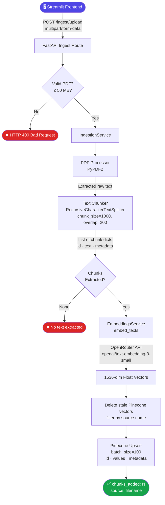
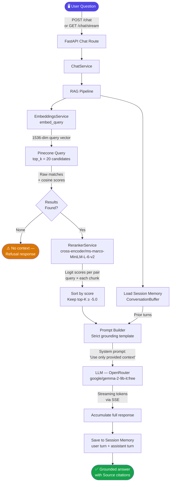
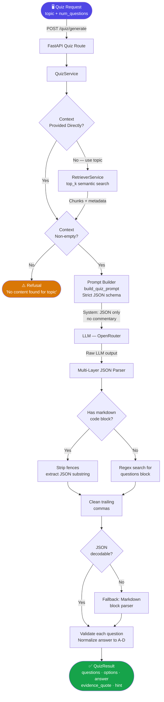
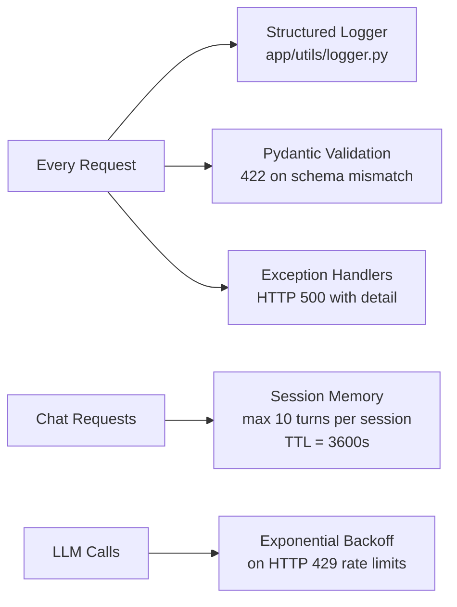

# AI Tutor — System Flow Diagrams

Detailed flow diagrams for every major operation in the AI Tutor platform. Each diagram traces the exact path data takes through the system — from raw user input to a grounded, AI-generated response.

---

## 📥 Flow 1: Document Ingestion (PDF → Pinecone)

Describes how an uploaded PDF is transformed into searchable vector embeddings.

**Key steps:**
1. File validation (PDF only, ≤ 50 MB)
2. Text extraction per page with page-number metadata attached
3. Recursive character splitting with 200-char overlap for context continuity
4. Cloud embedding via OpenRouter (or local via Sentence-Transformers)
5. Atomic upsert — old chunks for the same source are deleted first

---

## 💬 Flow 2: Grounded RAG Chat (Query → Streamed Answer)

Describes the two-stage retrieval and generation pipeline for user questions.

**Key steps:**
1. Query is embedded using the same model as ingestion (embedding space consistency)
2. Pinecone returns the 20 closest chunks by cosine similarity
3. Cross-Encoder reranker re-scores all 20 pairs with full attention — no hallucination shortcut
4. Only chunks with reranker logit ≥ -5.0 pass to the prompt
5. A strict system prompt forbids the LLM from going beyond the provided context
6. Response is streamed token-by-token (SSE) and saved to session memory

---

## 📝 Flow 3: AI Quiz Generation (Topic → JSON Quiz)

Describes how a grounded, evidence-backed quiz is created from document content.

**Key steps:**
1. If only a `topic` is provided, the quiz service calls the retriever to build context
2. If retrieval returns empty context the system refuses — no questions are generated from thin air
3. A strict prompt instructs the LLM to output **only** a JSON object with `questions[]`
4. The parser runs a 4-stage extraction strategy to handle any LLM output quirks
5. Answer normalization ensures the `answer` field is always a clean `A/B/C/D`

---

## 🔄 Cross-Cutting Concerns

---

## ✅ Core Grounding Principles

| Principle | Implementation |
|---|---|
| **No Fabrication** | LLM system prompt: "Answer ONLY from the context below. If unsure, say 'I don't know'." |
| **Evidence Required** | Quiz questions must include a `evidence_quote` directly from the source PDF |
| **Refusal Logic** | Empty retrieval result → immediate refusal before any LLM call |
| **Source Citations** | Every chat answer includes `[Source N] (Page P, filename)` references |
| **Schema Contracts** | Pydantic enforces exact JSON structures for all API requests and responses |
| **Stale-Safe Ingestion** | Re-uploading a document first deletes all previous chunks for that source |
