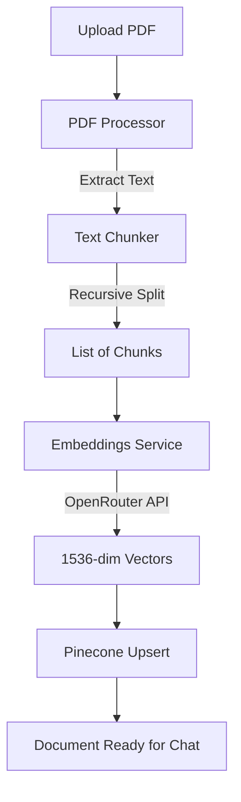

# AI Tutor Flow Diagrams

Below are the operational flows of the AI Tutor platform. These diagrams illustrate the path from raw data to a grounded, AI-generated response.

## 📥 Ingestion Flow (PDF -> Vector DB)

This flow describes how a student's document is processed and indexed for future search.



---

## 💬 RAG Chat Flow (Query -> Answer)

This flow explains the Retrieval-Augmented Generation (RAG) process used to answer user questions using only document context.

```mermaid
graph TD
    A[User Query] --> B[Embeddings Service]
    B -->|Generate Query Vector| C[Pinecone Query]
    C -->|Top-K Chunks| D[Retriever Service]
    D --> E[Reranker Model]
    E -->|Scored Relevance| F[Grounded Context]
    F --> G[Prompt Builder]
    G -->|Strict System Instructions| H[LLM (OpenRouter)]
    H -->|Verified Response| I[User Answer]
```

---

## 📝 Quiz Generation Flow (Topic -> JSON Quiz)

The flow for creating grounded, educational assessments.

```mermaid
graph TD
    A[Quiz Topic] --> B[Pinecone Semantic Search]
    B --> C[Topic Context Chunks]
    C --> D[Strict Quiz Prompt]
    D -->|Evidence-Based Quoting| E[LLM (OpenRouter)]
    E --> F[Pydantic Schema Validation]
    F --> G[JSON Quiz with Citations]
    G --> H[User Test]
```

---

### Core Grounding Principles:
1. **Verbatim Evidence:** For every quiz question, the AI must provide a direct quote from the source PDF.
2. **Refusal Logic:** If the Pinecone search returns no relevant chunks for a topic, the system automatically refuses to generate a quiz, preventing hallucinations.
3. **Citations:** Every chat answer includes `[Source X]` tags mapping to specific page numbers.
